# 🖼️ 《第2章 深海声传播区域信道稀疏特性》论文插图集

> **论文源文件**：[【09】存档-论文-有目录_27-54.pdf](file:///e:/大学/科创/扩频通信/Bellhop2YS/Bellhop2YS/【09】存档-论文-有目录_27-54.pdf)

---

### 图 2.1 深海跨节点通信声线轨迹示意图
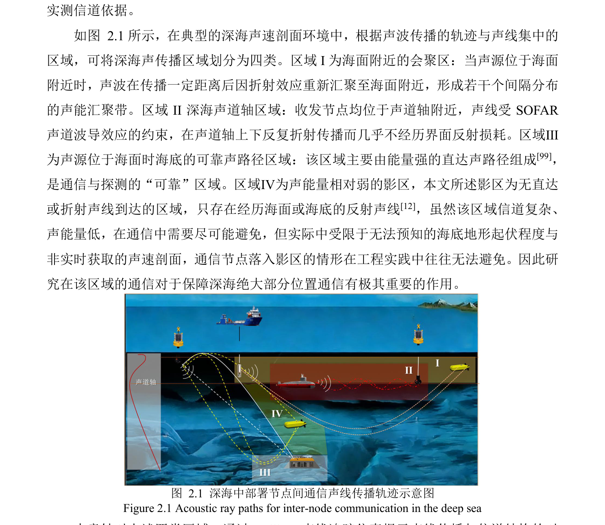

---

### 图 2.2 南海 CTD 布放位置
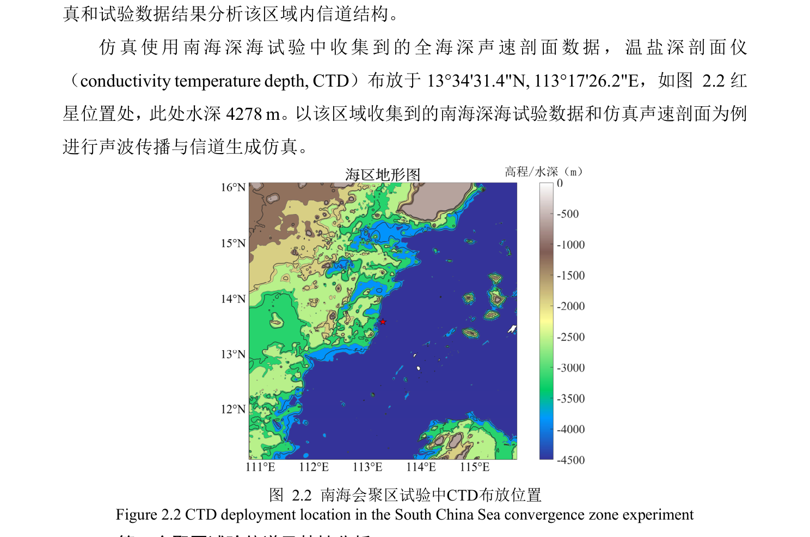

---

### 图 2.3 声源位置 100m 在 120km 内声线轨迹
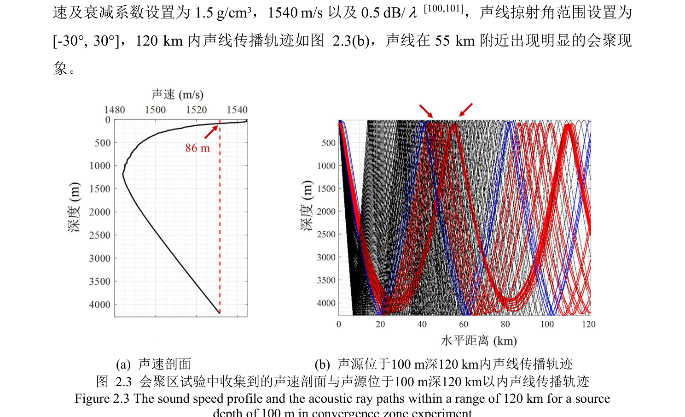

---

### 图 2.8 110m 深通信距离 45~55km 处本征声线与仿真信道冲激响应
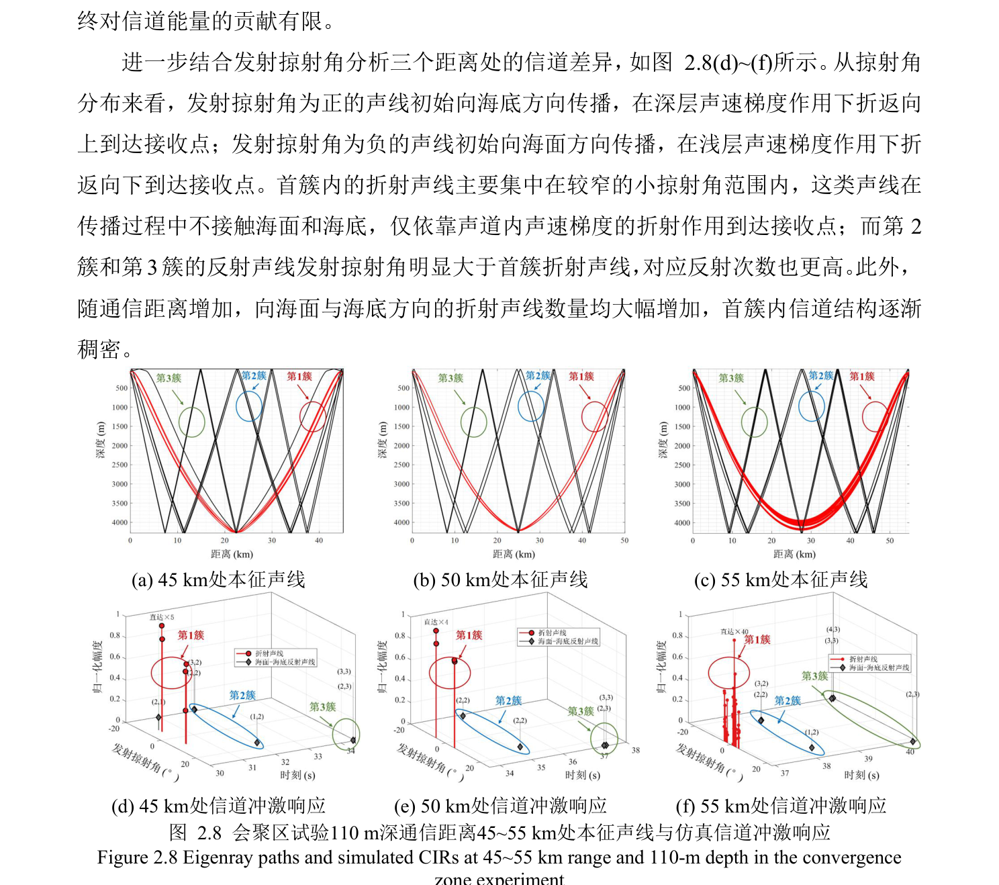

---

### 图 2.9 110m 深通信距离 45~55km 处信道冲激响应首簇放大图
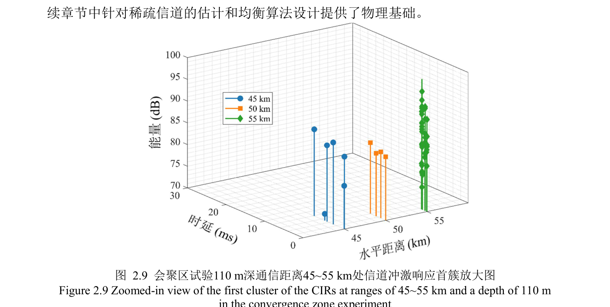

---

### 图 2.10 声道轴试验中 CTD 布放位置及对应声速剖面
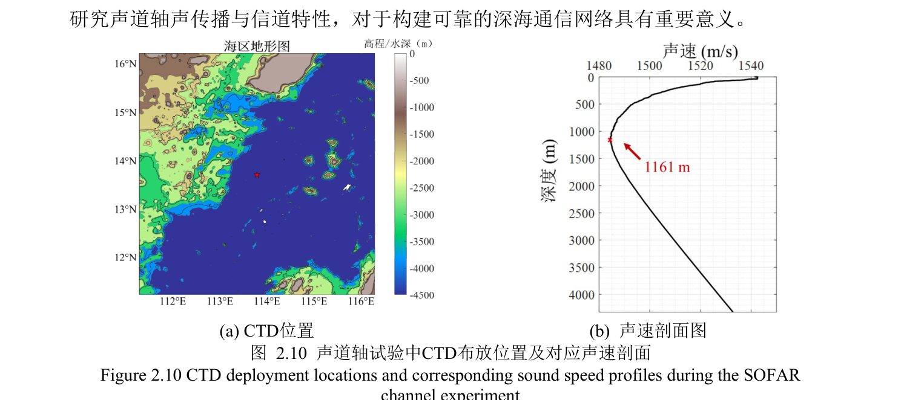

---

### 图 2.11 声源位于 1100m 的声线传播轨迹与 120km 以内传播损失
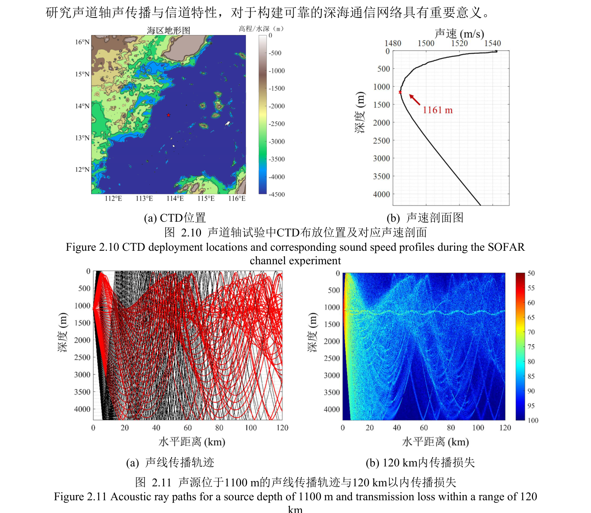

---

### 图 2.12 声道轴试验中深度 1151m 距离 20km 接收信号波形图与时频图
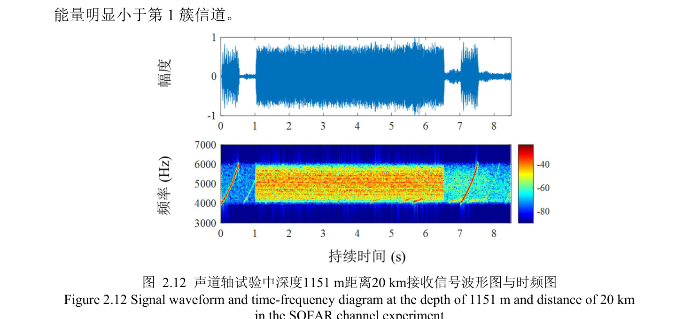

---

### 图 2.13 声道轴试验中深度 1151m 距离 20km 处本征声线与仿真信道冲激响应
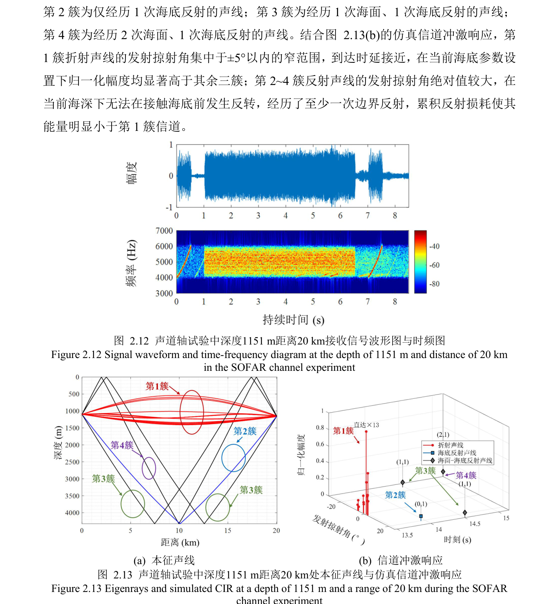

---

### 图 2.14 声道轴试验中深度 1151m 距离 20km 处实测与仿真信道冲激响应
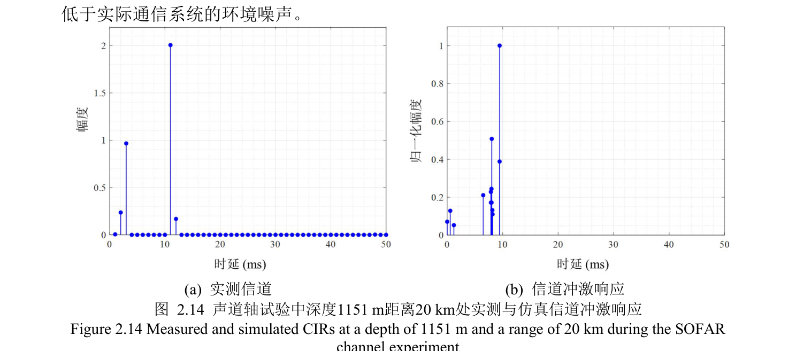

---

### 图 2.19 RAP 试验发射 15m 接收 4279m 距离 20km 接收信号波形图与时频图
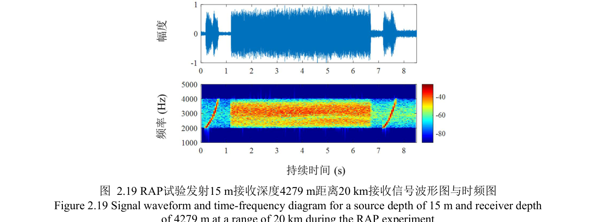

---

### 图 2.24 RAP 试验发射 200m 接收深度 3979~4279m 通信距离 30km 处本征声线与仿真信道冲激响应
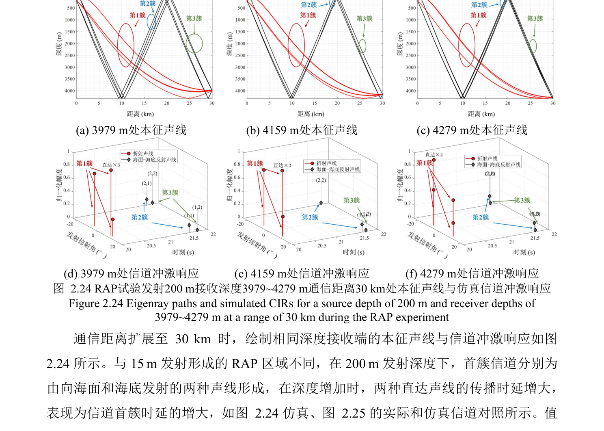

---

### 图 2.26 发射声源在 15m 的 20km 以内声线轨迹与选取点位
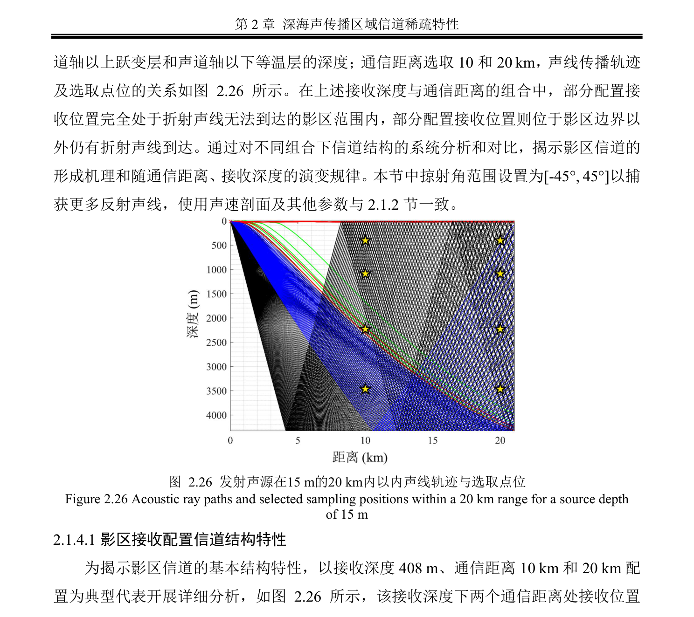

---

### 图 2.27 影区试验发射深度 15m 接收深度 408m 距离 10 和 20km 处接收信号波形图和时频图
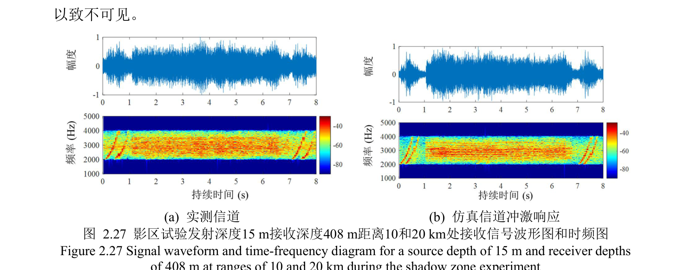

---

### 图 2.28 影区试验发射深度 15m 接收深度 408m 距离 10 和 20km 处本征声线与信道冲激响应
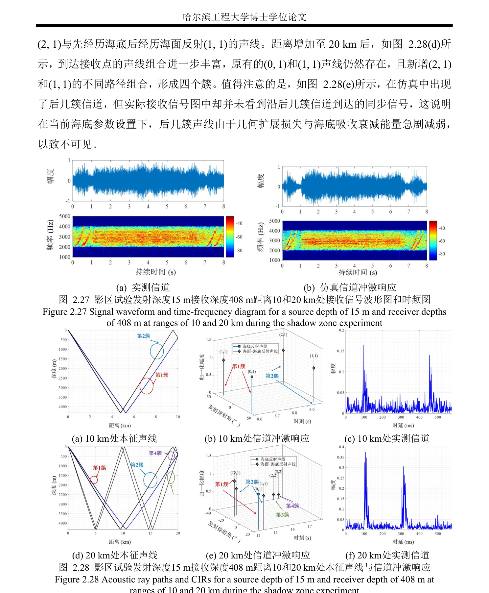

---

### 图 2.34 存在折射或直达声线的区域仿真与实测信道冲激响应对比
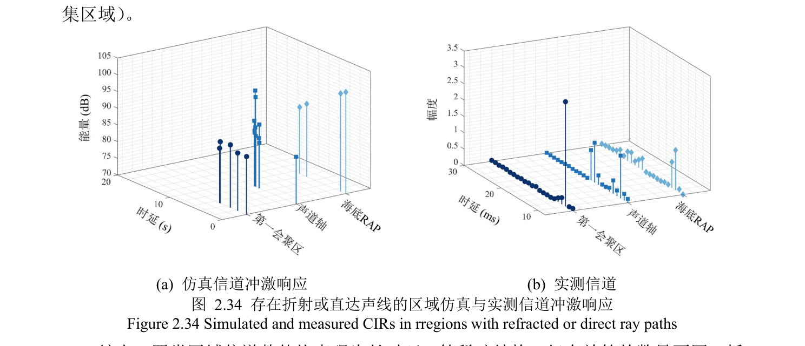
